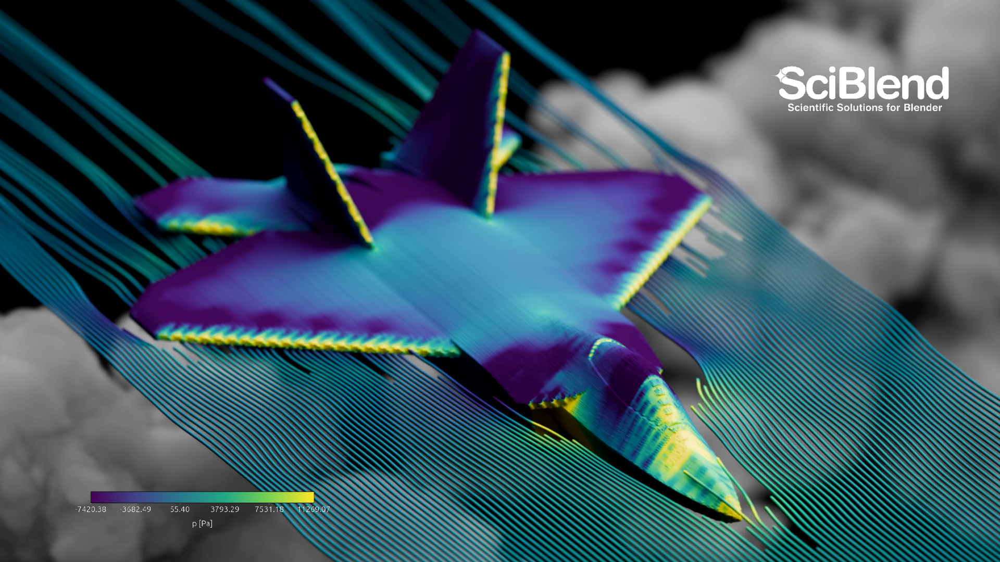

# SciBlend

[](https://doi.org/10.1016/j.cag.2025.104264) [](https://doi.org/10.5281/zenodo.15420392)
[](https://www.youtube.com/watch?v=X2UXjIVHyEs&ab_channel=Jos%C3%A9Mar%C3%ADn)


[](https://github.com/SciBlend/SciBlend/actions)
[](https://github.com/SciBlend/SciBlend/releases/download/v.1.1.2/sciblend-1.1.2-linux_x64.zip)
[](https://github.com/SciBlend/SciBlend/releases/download/v.1.1.2/sciblend-1.1.2-windows_x64.zip)
[](https://github.com/SciBlend/SciBlend/releases/download/v.1.1.2/sciblend-1.1.2-macos_x64.zip)
[](https://github.com/SciBlend/SciBlend/releases/download/v.1.1.2/sciblend-1.1.2-macos_arm64.zip)

<picture>
  <source media="(prefers-color-scheme: dark)" srcset="./images/sciblend-favicon.png">
  <source media="(prefers-color-scheme: light)" srcset="./images/sciblend-favicon-dark.png">
  
</picture>

**SciBlend** is an extensible, Python-based toolkit developed to facilitate advanced scientific visualization workflows within Blender. It integrates Blender's rendering capabilities (Cycles & EEVEE) with functionalities for processing and visualizing complex computational data, aiming to bridge the gap often found between specialized data analysis tools and general-purpose 3D creation suites.





## Install

### Official Blender Extension
The recommended way to install SciBlend is through the official Blender Extension Store:

[](https://extensions.blender.org/add-ons/sciblend/)

1. Open Blender > Edit > Preferences > Get Extensions
2. Search for "SciBlend" and click Install
3. Enable the SciBlend add-on in case it's not active

### Manual Installation from GitHub Release
Alternatively, you can install manually from GitHub:

1. Download the platform zip above for your system
2. Open Blender > Edit > Preferences > Add-ons
3. Select "Install from Disk", select the downloaded zip
4. Enable the SciBlend add-on in case it's not active

### Development Version
To install the latest development version:

1. Go to GitHub Actions: https://github.com/SciBlend/SciBlend/actions
2. Select the latest successful workflow run
3. Download the artifact for your platform
4. Extract the downloaded zip to get the actual extension zip file
5. Install manually following the steps above

After enabling, open View3D > Sidebar > SciBlend. 

## 🧩 Components included

- Advanced Core: scientific data import for static and animations (.x3d, .vtk, .vtu, .pvtu, .vtp, .pvtp, .nc, .nc4, .shp)
- Shader Generator: scientific colormaps and shader creation
- Legend Generator: compositor-based legends
- Grid Generator: coordinate grids and guides
- Shapes Generator: compositor shapes
- Notes Generator: 3D annotations
- Compositor: camera, formats, and render helpers

## ⚙️ Requirements

- Blender 4.5.1 LTS+

## 🔄 Workflow Overview

SciBlend is designed to integrate into scientific visualization pipelines as follows:

1.  **Data Preparation (External, Optional):** Tools such as ParaView can be used for initial data processing, filtering, and preparation of large datasets. SciBlend includes ParaView macros to aid data export.
2.  **Import & Setup (SciBlend Advanced Core / Core):** Import static or time-varying datasets into Blender.
3.  **Material Application (SciBlend Shader Generator):** Apply or define shaders and colormaps based on data attributes.
4.  **Contextualization & Annotation (SciBlend Grid, Shapes, Notes Generators):** Incorporate coordinate systems and annotations.
5.  **Legend Generation (SciBlend Legend Generator):** Create legends to correlate visual elements with data values.
6.  **Scene Composition & Rendering (SciBlend Compositor):** Adjust camera settings, lighting, and render parameters using Cycles or EEVEE.


## 📚 Tutorials (In Development)

Get started with SciBlend by following our video tutorials. These guides cover everything from installation to advanced features. Please note that these tutorials are currently under development.

> **Note:** Installation video differs from the installation method explained above. This video corresponds to v.1.0.0. Now it's easier to install SciBlend.


**Accessing the SciBlend Tutorial Videos (Hosted on Vimeo):**

1.  **Tutorial 1: Installation** --- Duration: 5:27  
    [Watch Video](https://vimeo.com/1072114774/6710c26719)
2.  **Tutorial 2: Blender Basics** --- Duration: 3:38  
    [Watch Video](https://vimeo.com/1072322575/5f76df6d54)
3.  **Tutorial 3: Paraview Macros** --- Duration: 4:12  
    [Watch Video](https://vimeo.com/1072343076/bcd85df516)
4.  **Tutorial 4: Disclaimer** --- Duration: 0:50  
    [Watch Video](https://vimeo.com/1072534713/d5745037c5)
5.  **Tutorial 5: Advanced Core** --- Duration: 9:38  
    [Watch Video](https://vimeo.com/1072467895/4b891cdc36)
6.  **Tutorial 6: Shader Generator** --- Duration: 2:49  
    [Watch Video](https://vimeo.com/1072516398/ba57a7f44b)
7.  **Tutorial 7: Compositor and Rendering** --- Duration: 9:14  
    [Watch Video](https://vimeo.com/1072530634/4d23fbf807)

**Total Course Duration:** Approximately 35 minutes and 48 seconds.

**Accessing Tutorial Datasets:**

The primary "Hearts Dataset" (preprocessed for tutorial use) are not publicly hosted for direct download. Access to these materials for tutorial purposes may be requested by contacting the project maintainers:

Requests for access to other datasets mentioned in tutorials or associated research (e.g., Atrial, DualSPHysics datasets) should be directed to the support team at `info@sciblend.com`.


## 📜 Citing SciBlend

If SciBlend or its components are used in research or publications, please include the following citations:

1.  **The SciBlend Paper:**

```
@article{marin2025,
title = {SciBlend: Advanced data visualization workflows within Blender},
journal = {Computers & Graphics},
volume = {130},
pages = {104264},
year = {2025},
issn = {0097-8493},
doi = {https://doi.org/10.1016/j.cag.2025.104264},
url = {https://www.sciencedirect.com/science/article/pii/S0097849325001050},
author = {José Marín and Tiffany M.G. Baptiste and Cristobal Rodero and Steven E. Williams and Steven A. Niederer and Ignacio García-Fernández},
keywords = {Scientific visualisation, Blender, Paraview, Data rendering, Visual storytelling, Scientific communication}
}
```

3.  **The Software Suite:**
```
@software{sciblend2025,
doi = {10.5281/ZENODO.15420392},
url = {https://zenodo.org/doi/10.5281/zenodo.15420392},
author = {José Marín},
title = {SciBlend: Advanced Data Visualization Workflows within Blender - Software},
publisher = {Zenodo},
year = {2025},
copyright = {Creative Commons Attribution 4.0 International}
}
```


(Source code: https://github.com/SciBlend/SciBlend)


## 🤝 Contributions

Contributions to the SciBlend project are welcome. This includes issue reporting, feature suggestions, or pull requests.

-   For issues concerning the overall suite or the installation process, please use the issue tracker in this main repository.
-   For contributions related to specific addons, please refer to their individual GitHub repositories (linked above).

## 💬 Support & Contact

For inquiries or support:
-   Primary Contact: info@sciblend.com
-   For issues specific to an addon, use the issue tracker on that addon's GitHub repository.

---